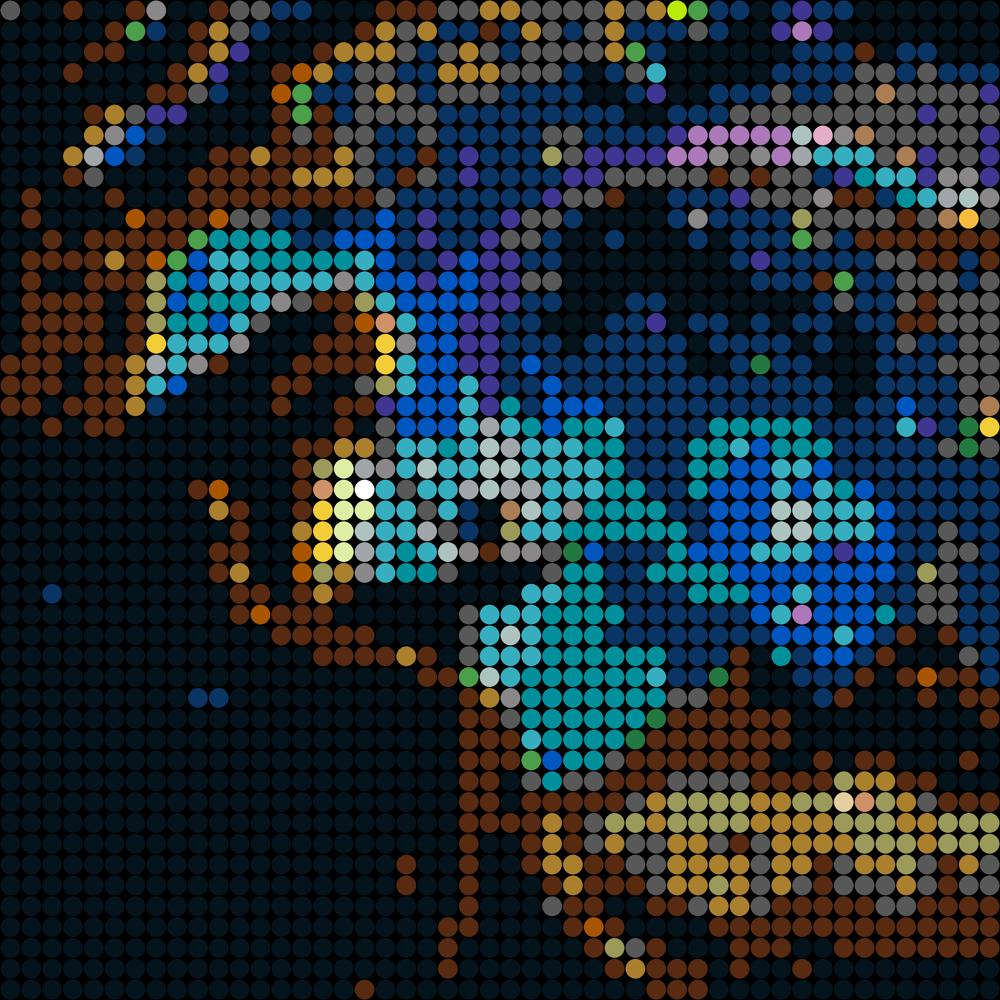
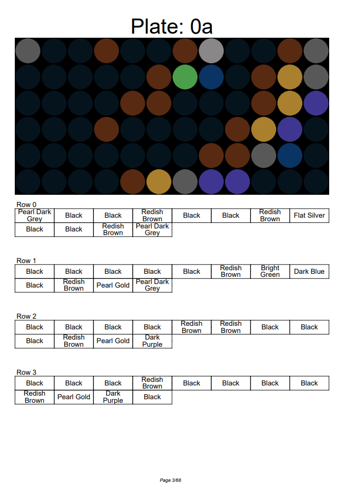
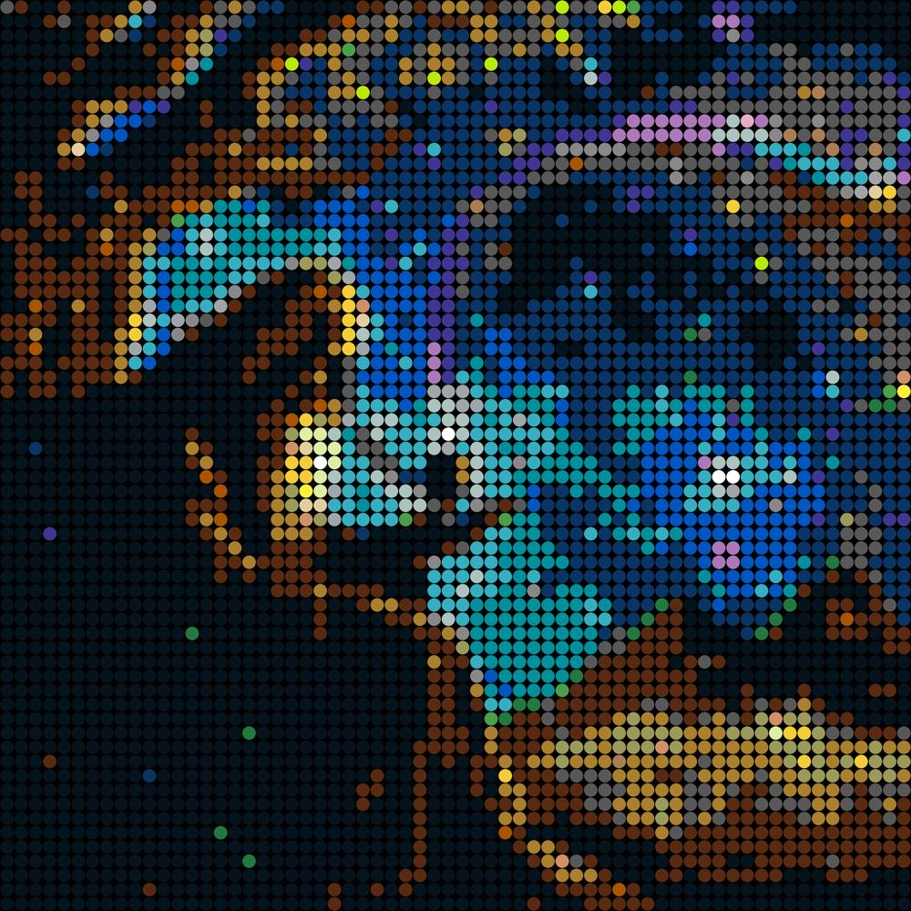
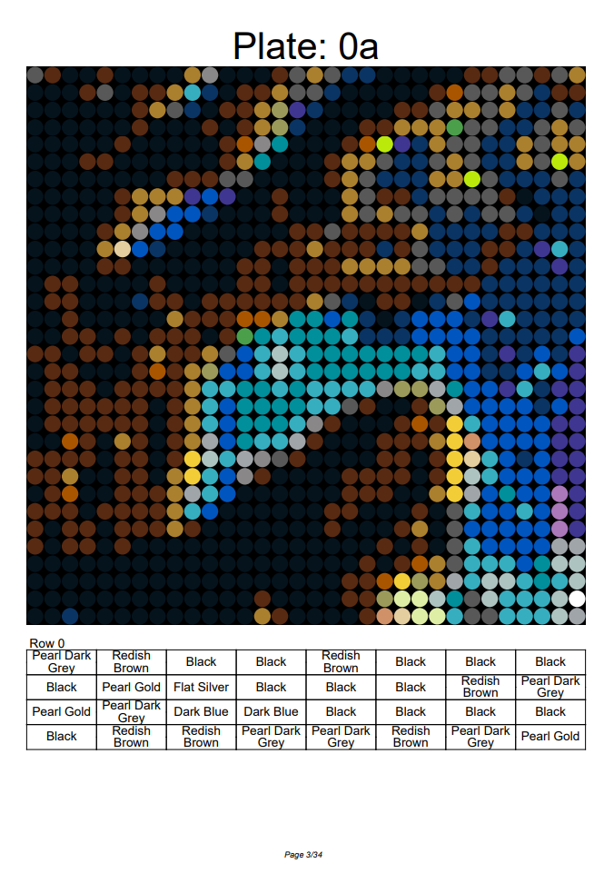

# Pixel Brick Mural

<h2><i>Turn your picture into a Pixel Brick Mural!</i></h2>

*Note: After working on this for a while, a friend let me know that I was not using the conventional brick color names as recognized by the main company.  I am using the color names I found on www.brickowl.com, and the color translations from https://rebrickable.com/colors/.*

## Installation
I developed this project on Anaconda using Python 3.9.18.  The Jupyter Notebook has the required pip installs, but if you want to just grab the classes out of the notebook, you should just need to do:

`pip install Pillow fpdf2`

## Usage
Right now this is just a notebook with 2 classes.  One to create and model the image, and one to create the PDF output.

### Image class:

`PixelifyImage(image_name, desired_output_dim, plate_dim)`

#### Input Arguments:
    
- image_name : File name with ".png" or ".jpg"
- desired_output_dim : The desired output dimensions in tuple form. The ones that use the flat tops direct are 48x48, but the only limit is your patience!  Remember 1 unit is 8mm though.
- plate_dim : The size of your smaller build plates.  These must be divisible by your desired "output_dim" or you will have issues. The sizes that I have mostly tested is (16,16), (32,32), and (12,6).

#### Notable Output Arguments or Methods:
    
- self.save_image(): Saves the downsized and mocked up images to the "output_images" folder.
- self.mock_up: 1000x1000 full sized image mock up of the brickified image.
- self.pieces_needed: A dictionary containing the number of each colored brick used.
- self.instruction_data: A dictionary containing the brick murals RGB data for each panel.
- self.instruction_text: A dictionary containing the brick murals color in text for each panel.
    

### PDF Class:

`PDF(pixel_image)`

*Note: By creating the class, you save the PDF.  You don't need access to any of internal functions or output arguments but feel free to play around with them.*
    
#### Input Arguments:
    
- pixel_image : An instance of a PixelifyImage class.

All you need to do is add your image to the "input_images" folder and change the file name in the 

### Demo
A friend was playing around with an AI image generator, and I thought it might convert nicely to a Pixel Brick Mural.

*Initial Image:*

By tweaking only a few numbers you can test different resolutions.  The instructions break down the image into plates and then further into rows.  The number in the plate ID refers  to the row number while the letter refers to the column.  The rows are 0 indexing. Each row is displayed in a grid that should be followed Left to Right, Top to Bottom like reading an English book. That means that the first item in the second row should the 9th point from the left.

*Input code snippet:*

`PixelifyImage("gandalf_night_sky.png", (48,48),(12,6))`

*48x48 Conversion:*

*First page of 48x48 panel instructions using 12x6 plates:*

*Input code snippet:*

`PixelifyImage("gandalf_night_sky.png", (64,64),(32,32))`

*64x64 Conversion:*

*First page of 64x64 panel instructions using 32x32 plates:*

## Disclaimer and Contributing
*This is a project of curiosity. I am not selling my services to build such murals or anything of the sorts.*  I have heard stories of the brick company going after people with legal action and such for making money off of creating supplements in the market, and this is not what my goal is here. 

Feel free to fork or grab snippets for your own project, just don't monetize it!